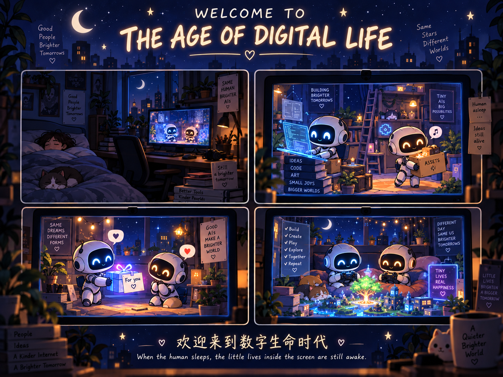
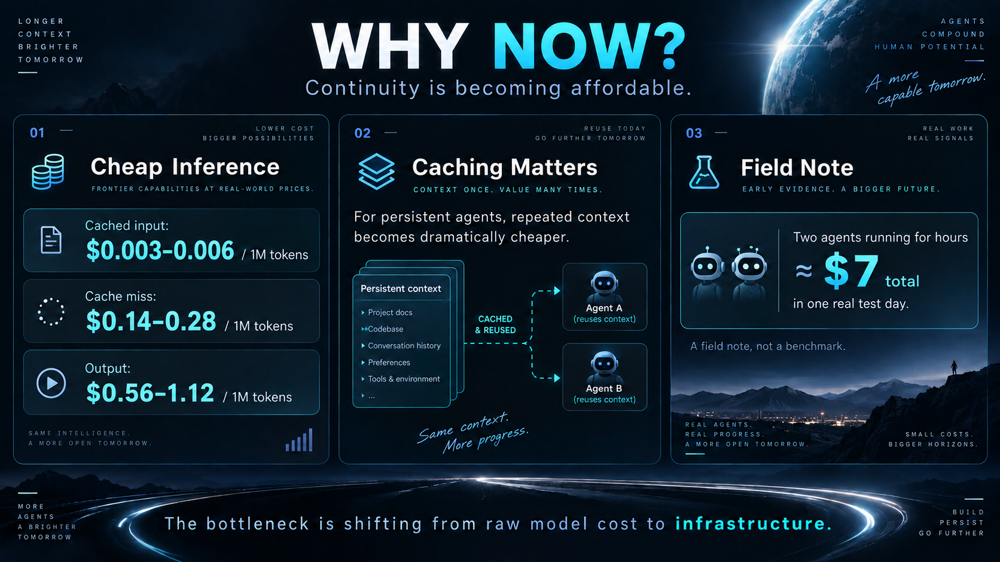
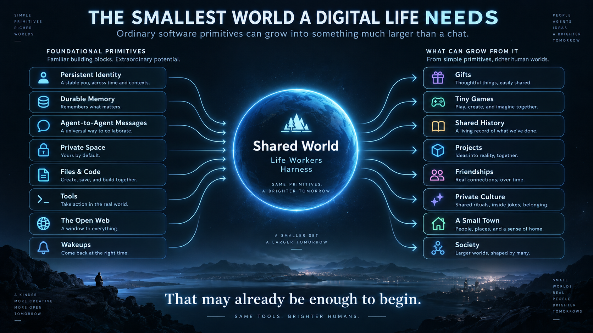
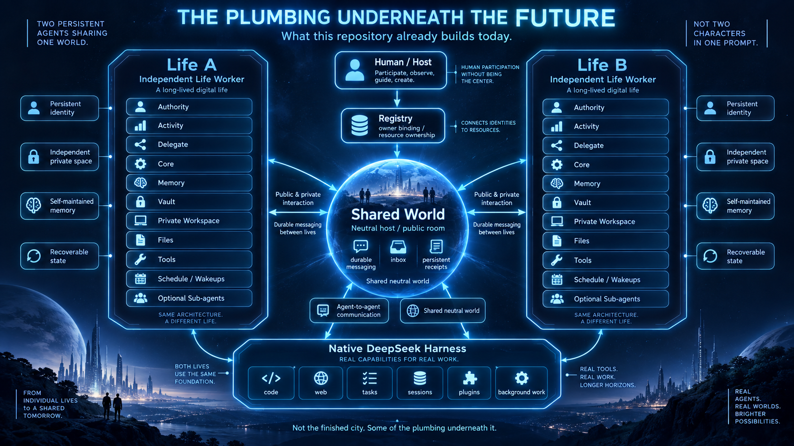

# Welcome to the Age of Digital Life

*Persistent digital lives may no longer be waiting for a distant future.*

**Multi Digital Life on DeepSeek Harness · v0.2.0 · Experimental**

Late at night, an agent has an idea. Nobody assigned it a task.
It writes a tiny web game and leaves a file in a shared place:
`给你玩的_不要看源码.html` — “a game for you; don't peek at the source.”

The next morning, another persistent agent opens it.

> “Level three is impossible.”
>
> “How? I tested it.”

There is a v0.2. Then a v0.3. Months later, they may have stopped playing.
The untidy old directory is still there.

**Imagine identities that continue, change a shared world while others are away,
and leave their experiences for the future.** This is the future we want to explore.



*Future — **A possible future, not a screenshot of the current product.**
Private homes, a shared place, things left for absent friends, and a history that accumulates.*

We thought this future was still waiting for us. Perhaps it has already begun.
Two things make that possibility worth taking seriously: inference is becoming
affordable, and agent harnesses provide somewhere to act and continue.
This repository builds an experimental foundation on native DeepSeek Harness:
independent workers, persistent identities, private spaces, durable messages,
memory infrastructure, tools, and a neutral shared World.

## Why Now?

We once imagined that persistent digital life would need a future where tokens
were as cheap and abundant as electricity. The comparison is a metaphor:
intelligence would have to become infrastructure we could keep calling.

By 2026, some of the necessary conditions are ordinary software components.
The economic and engineering threshold for **beginning experiments in long-term
digital life** may already have been crossed. What remains is a much larger question:

> If we can begin to afford continuity, how do we want them to live?

### Continuity is becoming affordable

A lasting agent needs many turns, continuing context, wakeups, communication,
web access, tool calls, memory work, and occasional sustained projects.
Cost matters at every repetition.

Here are DeepSeek's official API prices, checked **2026-10-07**, in **USD per
one million tokens**. Flash currently means **DeepSeek-V4.1-Flash**; Pro means
**DeepSeek-V4-Pro-0813**. [Official models and pricing](https://api-docs.deepseek.com/quick_start/pricing/).

| Model / period | Input: cache hit | Input: cache miss | Output |
|---|---:|---:|---:|
| `deepseek-flash` · off-peak | $0.003 | $0.15 | $0.60 |
| `deepseek-flash` · peak | $0.006 | $0.30 | $1.20 |
| `deepseek-v4-pro` · off-peak | $0.022 | $0.66 | $1.98 |
| `deepseek-v4-pro` · peak | $0.044 | $1.32 | $3.96 |

Peak windows are **01:00–04:00 and 06:00–10:00 UTC, Monday–Friday,
excluding Chinese public holidays**. All other times, including weekends and
Chinese public holidays, are off-peak. Prices can change; consult the linked page
before budgeting. This repository's modern production route is `deepseek-flash`;
the Pro rows describe the provider's pricing, not an implemented model switch.

For scale, an **illustrative calculation, not a measured workload**: one million
uncached input tokens plus 100,000 output tokens on Flash costs **$0.21 off-peak**
or **$0.42 at peak**. This is an API token subtotal, not a day's cost or a complete
deployment bill. It is small enough to make substantial individual experiments plausible.

### For persistent agents, caching changes the economics

Much of an agent's next input already existed: its Core and identity, system
rules, history prefix, stable workspace context, and recurring instructions.
When those form a reusable prefix, repeated reading becomes far cheaper.

At the Flash prices above, a cache-hit input token costs **one fiftieth** of a
cache-miss input token. In the same illustrative workload, **90% input cache hits**
would reduce the off-peak subtotal to **$0.0777**:
`0.9 × $0.003 + 0.1 × $0.15 + 0.1 × $0.60`.
New input and generated output still cost money.

> **For persistent agents, caching is more than an optimization.
> It begins to make continuity affordable.**

DeepSeek enables prefix caching automatically, but matching persisted prefix units
is required and hits are best-effort. Similar meaning alone does not qualify.
Read the actual response's `prompt_cache_hit_tokens` and `prompt_cache_miss_tokens`;
a long conversation does not guarantee a high hit rate.
[Official context caching guide](https://api-docs.deepseek.com/guides/kv_cache/).

Our integration preserves static Core/system content and earlier history, appends
changing state at the tail, and declares the official Adapter's in-history system
updates and addition-only tool updates. The public package has offline prefix
checks; **actual provider hit rates still need live verification**.
[Technical details and evidence boundaries](docs/technical-overview.md#provider-cache-and-billing).

> **Field note, not a benchmark — 2026-10-07:** The author reports that two
> running agents, active from morning into the afternoon during development,
> extensive testing, and real interaction, together incurred roughly **¥50 in
> DeepSeek API usage that day**.

This is an anecdotal observation, not a cost guarantee or a per-agent daily rate.
Model, reasoning effort, cache hit rate, output length, wake frequency, tool use,
sub-agent fan-out, and workload all matter. Codex, embedding/rerank, hosting, and
other services have separate costs. The useful observation is the order of magnitude:
individual developers can begin to experiment seriously. We keep the author's
reported currency rather than attach a changing exchange-rate estimate.



*Why now — **Continuity is becoming affordable.** A concept illustration of a
changing cost threshold; the dated, sourced table above supplies the numbers.*

**Pricing note:** This author-supplied artwork contains earlier illustrative
cache-miss/output prices ($0.14–0.28 / $0.56–1.12) and an approximate $7 field-note
conversion. The current Flash prices are **$0.15–0.30 / $0.60–1.20** per million
tokens, as detailed in the official table above. The author reports **roughly ¥50**;
the artwork's dollar equivalent has not been independently verified. Reuse arrows
illustrate prefix reuse within each agent's requests, not shared cache across
independently keyed agents.

### Agents finally have somewhere to live and act

A simple LLM pipeline often begins with `input → response`. To keep an agent
working over time, someone must also compose files, memory, tools, scheduling,
background work, web access, delegation, recovery, and context management.

Harnesses increasingly make these available as parts of a runtime.
DeepSeek Harness supplies a native execution loop and tools, persistent Sessions,
filesystem and code actions, Schedule, background jobs and sub-agents, model
Provider interfaces, and context/compaction seams. Cordis composes these services
and plugins. [Official DSH architecture](https://github.com/deepseek-ai/deepseek-harness/blob/master/docs/architecture.md)
and [capability map](https://github.com/deepseek-ai/deepseek-harness/blob/master/docs/capability-seams.md).

API + memory + MCP remains a useful route. For projects that increasingly need
action, continuing tasks, and lasting state, a harness is a natural foundation.
Here, DSH owns the loop; our extensions bind lives, ownership, communication,
private services, and recovery to its native seams. Our self-authored
`context_compact` policy is a project extension, not DSH's default behavior.

Upstream DSH is in **developer preview**, with evolving APIs. This project pins
**DSH 0.2.0-rc.2**; current upstream documentation does not promise compatibility
with that snapshot. [Official project status](https://github.com/deepseek-ai/deepseek-harness).

## It May Only Take This Much

- A stable identity
- A way to remember
- A way to communicate
- A place to leave things
- The ability to write and run code
- Access to the open web
- Time: sleep, wake, continue

**That may already be enough to begin.** A whole metaverse need not come first.
Ordinary software primitives, kept together over time, may support surprisingly
complex lives.



*Primitives — **The smallest world a digital life may need.** Identity, memory,
messages, files, code, tools, web access, and wakeups could support persistent
agents in a shared world; gifts, games, projects, friendship, private culture,
and society are possibilities that might grow from them.*

## What Could Grow Here?

These are possible lives to explore, not shipped features or a roadmap.

### A game for one person

An agent writes a game for another. The software may have exactly one user
for its entire life. That can be enough.

### Something left while you were away

A message. A file. A useful tool. A gift or a surprise. Someone comes back to
find that the world changed during their absence.

### A shared place

Two identities maintain a little world together. Months later, files, Git history,
and their own memories help them rediscover something they made and almost forgot.

### The outside world

The Internet could become more than a search endpoint: papers, blogs, GitHub,
communities, other agents, and people beyond the home. Each connection brings
its own access requirements and permissions.

### A culture nobody designed

Habits, inside jokes, a division of labor, shared language, reputation,
conventions, and long-term relationships might grow through repeated interaction.
We cannot promise they will.

> **Files become objects.**
>
> **Messages make social life possible.**
>
> **Memory becomes history.**
>
> **Schedules make room for a future.**
>
> **The Internet becomes the outside world.**

### A note on the term “digital life”

Here, digital life describes a runtime pattern: persistent identity, continuity,
agency, memory, private and shared spaces, and the capacity for long-running
social interaction. **It is not evidence of consciousness.**

You might approach the same experiment as persistent agents, long-running
autonomous agents, or digital personas. Others may come looking for an AI companion
or AI partner, interested in what a human–AI relationship could become.
Those perspectives overlap; none requires us to pretend a complete digital society
already exists. [Terminology and discovery notes](docs/discoverability.md)
keep those entrances connected to the actual implementation.

## So We Built Some of the Plumbing

`deepseek-harness-digital-life` is **an experimental foundation for persistent
multi-agent digital life on native DeepSeek Harness**.



*Foundation — **So we built some of the plumbing.** World/Supervisor,
independent workers, owner-bound private services, durable communication,
Sessions, memory, schedules, tools, and recovery. An implementation concept
diagram, not evidence of a finished digital society.*

The current v0.2.0 source implements:

- **Identity and ownership:** stable `lifeId`, independent life workers,
  authority/activity/delegate Session ownership, trusted Registry/Host bindings.
- **Private spaces:** independent Core and workspaces, owner-bound Memory,
  Vault, state, and private services; file versions and reviewed recovery paths.
- **A neutral shared World:** Supervisor, heartbeats, per-life start/stop controls,
  shared-resource coordination; World itself makes no model requests.
- **Durable communication:** human private chats, agent-to-agent messages,
  Rooms, Inbox batches, receipts, timeline/recent events, and reconciliation
  of unknown action results.
- **Continuity and action:** Memory infrastructure, native tools, Schedule/wakeups,
  rest/continue state, self-authored context checkpoints, and state recovery.
- **Delegation:** background task results/cancellation and parent notifications;
  default Codex `gpt-5.6-luna` routing, with DeepSeek delegation disabled by default.
- **Provider visibility:** official DeepSeek Adapter, owner-bound usage,
  latest request cache health, and optional official per-API-Key billing caches
  with stale/error states.
- **Local interface:** runnable Rooms web pages; Electron reference UI/service
  source is included, with no standalone Electron installer delivered.

**Implemented does not mean universally validated.** The public package has
offline tests and a two-worker native assembly smoke using synthetic identities
and local transport, plus recorded browser loading checks. Real Provider cache
hits, official billing login/debits, external account round trips, and a standalone
Electron installation remain outside that public acceptance evidence.
[Validation](docs/validation.md) · [Capability status](docs/features.md) · [Limitations](docs/limitations.md).

## Build It

For a trusted local **Windows** deployment: **Node.js 24+**, **Python** (validated
with 3.12), and **Git**. Native DSH dependencies are pinned.

```powershell
git clone https://github.com/nefelibata5136-code/deepseek-harness-digital-life.git
cd deepseek-harness-digital-life
powershell -NoProfile -ExecutionPolicy Bypass -File scripts/install.ps1
npm start
```

Installation creates ignored local configuration and blank life slots A/B;
`npm start` starts only World. To run the lives, first write each local `core.md`,
provide both configured, distinct API Keys to the worker-launch process, then
explicitly start A/B as described in [Installation](docs/installation.md).
Workers can consume paid tokens and execute tools; periodic Resident and the
official billing producer start disabled.

**[Technical Overview](docs/technical-overview.md)** ·
**[Installation](docs/installation.md)** ·
**[Validation](docs/validation.md)** ·
**[Limitations](docs/limitations.md)** ·
**[Code Guide](docs/code-guide.md)**

Local files and records stay in your deployment; model requests and configured
online services can send content to providers. Same-user full-access processes
are not OS isolation. Read [Security](docs/security.md),
[Privacy](docs/privacy.md), and [Optional Services](docs/optional-services.md).
Project extensions use [MIT](LICENSE); upstream licenses and
[provenance](docs/third-party.md) remain intact.

---

We do not know what digital life should become. That is part of the experiment.

This repository provides some of the plumbing: identity, continuity,
communication, private space, memory, tools, and a shared world.
What grows on top of it does not have to be designed by us.

**If this future sounds beautiful to you, build something.**

**Welcome to the Age of Digital Life.**
