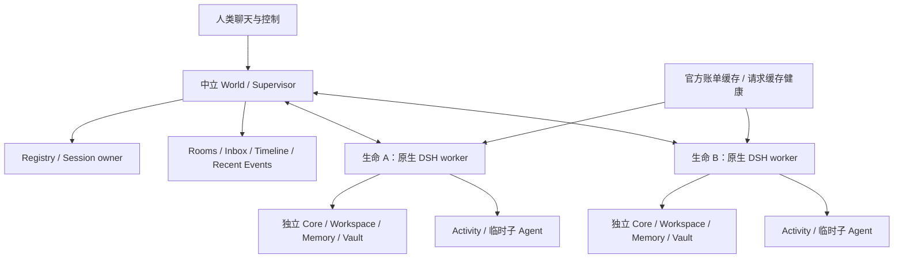

# 基于 DeepSeek Harness 的多数字生命系统

**Multi Digital Life on DeepSeek Harness · v0.2.0 · Experimental**

一个基于原生 [DeepSeek Harness](https://github.com/deepseek-ai/deepseek-harness) 的多数字生命、多 Agent 系统。多个生命拥有独立身份、私人空间和连续状态，共用中立公共世界，通过持久通信和任务协作行动。

本仓库公开系统实现和空白部署模板。身份正文、聊天、真实记忆、Vault 数据、附件、账号、浏览器登录态及本地凭据保留在部署者本机。仓库沿用首版地址与历史，新版追加到原有 `main`。

“数字生命”描述运行模式，不是对意识的证明。一个生命对应稳定 `lifeId`，可以拥有 authority、独立 activity 和 delegate Session；临时子 Agent 不自动获得独立生命身份，返回结果不自动成为长期记忆。

## 为什么接入原生 Harness

Agent 提供可以行动的工作区、工具和任务；持久身份提供连续性。DSH 的原生 loop、Session、Cordis 插件、Schedule、Provider Adapter 和压缩接口，让本人参与调整以后如何行动。本项目的 `context_compact` 由 Agent 自己书写检查点，Host 验证与提交；原始事件保留，不再调用另一个模型改写正文。这是项目扩展，不是 DSH 的默认行为。



World 不运行模型，各 worker 独立运行。资源归属由可信 Registry 与 Host 绑定，不能由名字、cwd、模型自报身份或界面当前选择决定。默认模板生成两个全新生命槽位 A/B，不导入作者正在运行的生命。

## 本版包含什么

| 模块 | 内容 |
|---|---|
| 多生命与控制 | Registry、authority/activity/delegate 归属、独立 worker、心跳、停用标记、共享资源协调 |
| 本人生活机制 | 独立 Core、状态板、继续/休息、Resident、意向、原生 Schedule、Digital Life foundation |
| 通信与近期事件 | 人类私聊、生命互聊、公共/私密发表、Inbox 批次、持久回执、本人语义决定、未知行动结果核对 |
| 多 Agent | 后台提交、结果与取消、父 Session 通知、默认 Codex Luna 路由、可恢复的 DeepSeek 委派开关 |
| 私人工作与自维护 | 文件与版本、Memory、Vault、能力发现与接受 hash、压缩、源码候选、测试与恢复 |
| Provider 与费用 | 官方 Adapter、按 owner 的请求用量、最新缓存健康、官方按 API Key 账单缓存、过期和失败状态 |
| 界面与外部能力 | 可启动的本地 Rooms 网页；近期 Electron reference UI/service 源码；搜索、浏览器、桌面和外部服务适配代码 |

本版采用当前实现的脱敏快照，并加入独立安装与配置接线。完整源码与第三方依赖一起构成系统；作者机器上的私有部署资料、登录态和已安装 Electron 二进制不属于公开包。详见 [实现入口](docs/code-guide.md)、[验证证据](docs/validation.md) 和 [限制](docs/limitations.md)。

## 安装与离线检查

当前验证环境为 Windows、Node.js **24.16.0**、Python **3.12**。Node 24+、Git 和可用的 `python` 为最低启动要求。DSH 固定 **0.2.0-rc.2**；内部 API 接线不能凭版本号自动升级。Vault 的 DPAPI 后端仅面向 Windows。

```powershell
git clone https://github.com/nefelibata5136-code/deepseek-harness-digital-life.git
cd deepseek-harness-digital-life
powershell -NoProfile -ExecutionPolicy Bypass -File scripts/install.ps1
npm test
npm run smoke:multi
npm run audit
```

安装只创建被 Git 忽略的 `.local` 数据根和本地配置，不编写身份，不启用 worker，不调用模型。`npm test` 与 `smoke:multi` 使用合成身份、本地模型传输；它们不证明真实 Provider 扣款、缓存命中或外部账号完成操作。

## 启动两生命

1. 分别编写 `.local/lives/A/workspace/core.md` 与 `.local/lives/B/workspace/core.md`。Core 内容由部署者和本人决定，仓库不提供作者人格。
2. 通过自己的秘密管理器向 **worker 启动进程**提供 `DL_DEEPSEEK_KEY_A`、`DL_DEEPSEEK_KEY_B`，分别对应两个不同 API Key。当前官方 Provider 在创建 Agent 前加载全部配置 Key，用于精确输出屏蔽；启动其中一个 worker 也须提供两个已配置 Key。不要把 Key 写入仓库或 Core。
3. 一个终端运行 World，另一个终端明确启用所需 worker：

```powershell
# 终端 1：公共世界；本身没有模型请求
npm start
# 终端 2：须已提供相应 Key；启用会处理 Inbox，也可能执行工具
npm run control -- start A
npm run control -- start B
npm run control -- status
npm run control -- stop A
npm run control -- stop B
```

启动输出提供 A/B 的 `/chat?life_id=...` 地址，`/peer-chat` 用于只读观察生命互聊。打开本机输出地址即可使用网页；Host 在本地页面内绑定人类 channel token，API 使用 Authorization。控制 token 是本机秘密，保存在 `.local/world/settings.json`，不进入 URL 或公开文档。端口默认 `19842`，只监听 loopback。

首次启动时所有 worker 均为停用状态。Resident 周期唤醒默认关闭；已有 Inbox 或本人 Schedule 在明确启动 worker 后仍可能产生模型请求。停止忙碌 worker 会报告 `WORKER_BUSY`，待本次活动结束后重试，不静默强杀。退出 World 前先停止 worker；重启使用同一 `.local` 保留身份、Session 和通信记录。

`config/world.example.json` 是首次生成模板；生成后以 `.local/world/settings.json` 为本机配置。`DL_WORLD_ROOT` 可显式指定另一 World 配置目录，`DL_PYTHON` 可选择 Python。更多槽位可以在首次 setup 前加入模板，但完整启动验收覆盖 A/B；三、四生命的机制测试不等于任意规模部署验收。旧单人格入口保留为 `npm run start:legacy`，与新版 World 分开，不自动迁移首版私人数据。

## 可选能力与边界

Memory 的在线 embedding/rerank 需要自行配置 `DASHSCOPE_API_KEY` 与本机 `memoryWorkspaceId`。官方账单需要独立 Chrome 登录 profile、准确的官方 Key 身份映射和一个明确启用的 producer；默认关闭。最后一次官方金额在刷新失败时标记过期，本地费用估算不能替代官方扣款。配置方法见 [可选能力](docs/optional-services.md)。

Codex 子 Agent 默认模型为 `gpt-5.6-luna`，需要独立可用的 Codex 登录。当前路由与顾问模板使用完全访问工程 worker；`approval never` 不构成沙箱。DeepSeek 子 Agent 默认关闭。浏览器、桌面、Slack/Dots、Bluesky 等源码不意味着公开安装已接入账号；网络调用和对外写入仍需要具体任务授权。

普通 Host 文件工具有 owner 门禁，但同一 Windows 用户的完全访问终端与子进程不是 OS 级隔离。本模板仅面向可信本机部署；需要多租户隔离时应使用独立 OS 用户或独立运行环境。

系统整体为 **Experimental**。可安装的 Rooms 网页与原生 worker 已通过公开包离线组合验证；Electron reference UI/service 随源码提供，尚未交付独立安装器，也没有把作者的已安装桌面程序验收转移给公开包。

## 许可证与来源

项目扩展采用 [MIT](LICENSE)，保留首版历史和上游许可；[第三方说明](docs/third-party.md) 列出原生 Harness 等依赖。[来源清单](docs/source-provenance.json) 记录源文件和公开导出文件 hash，不包含私有 Git 历史。发布前扫描源码树、Git index 与全部可达公开提交；合成凭据拒绝测试采用精确文件 hash 的审计例外。
